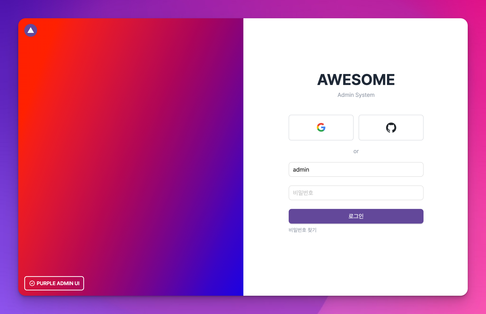
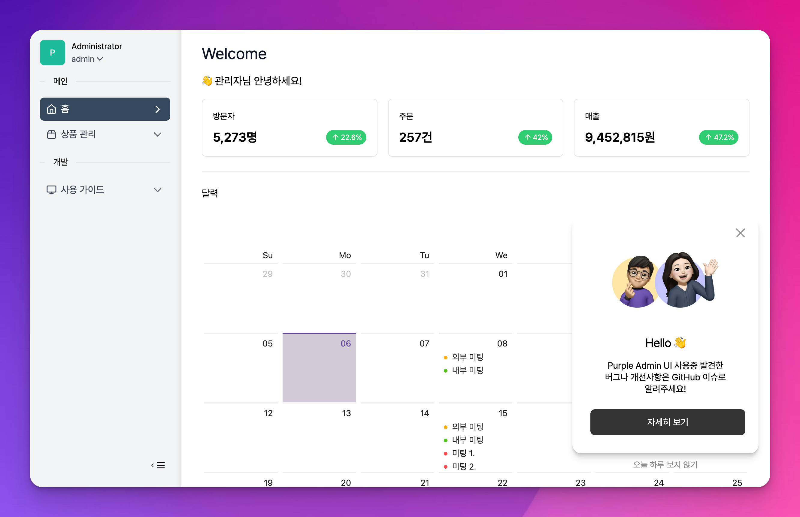
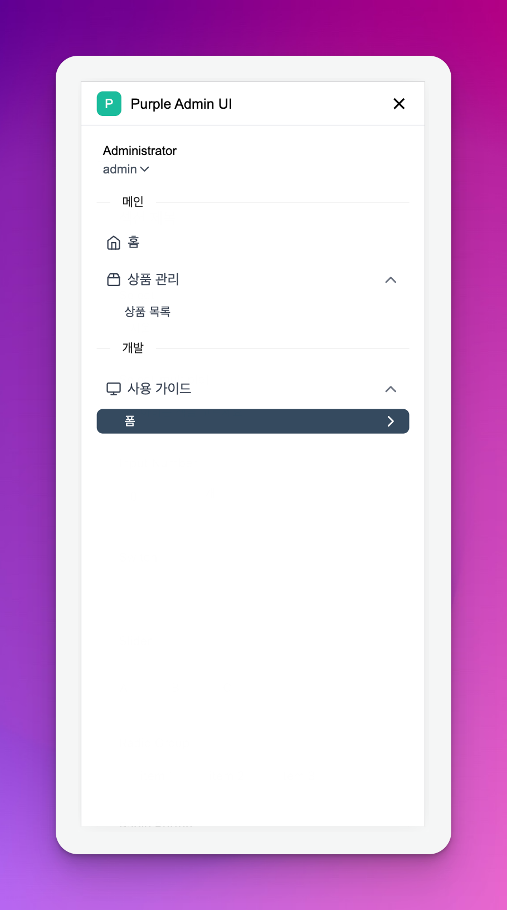
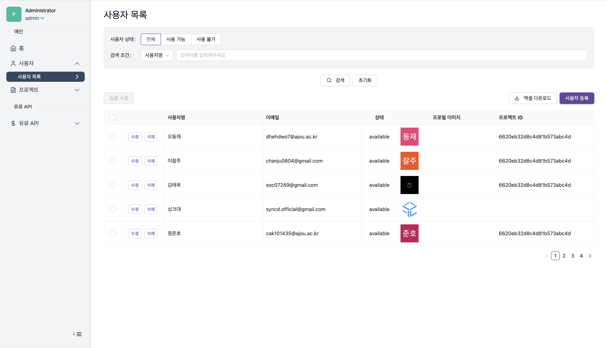
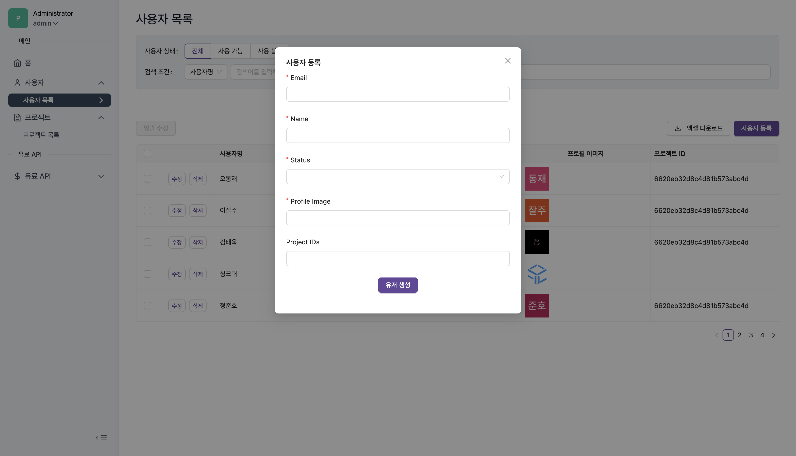
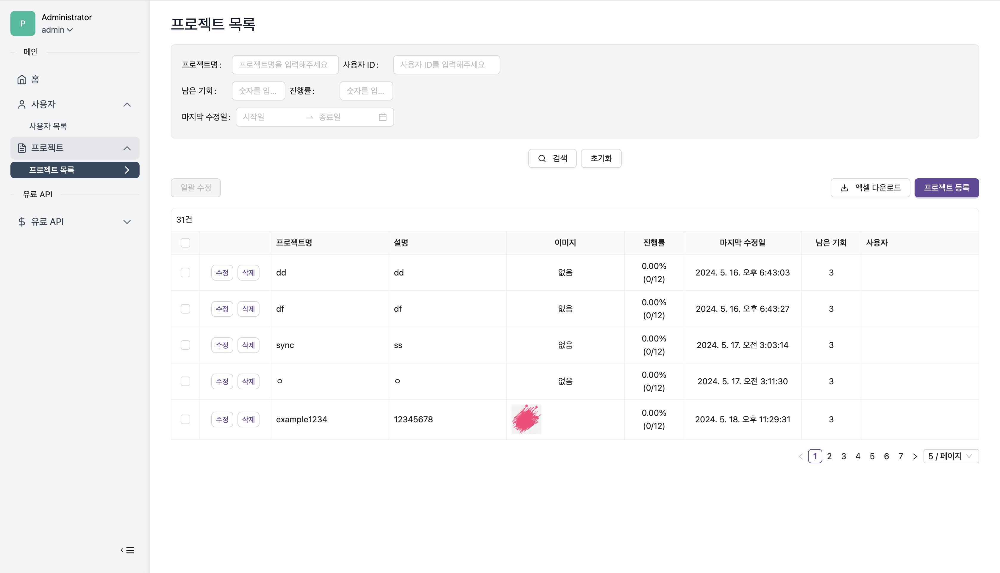
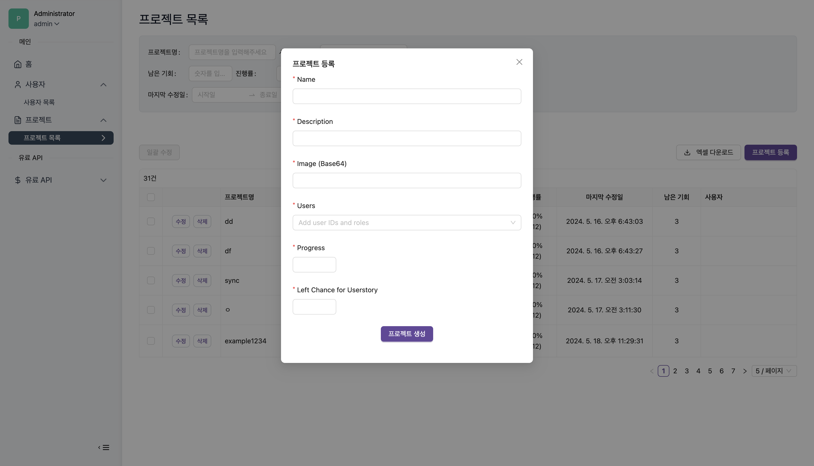

# 기술스택 & 기능

### Framework

- [Next.js](https://nextjs.org/) – Vercel에서 만든 React.js 기반 프레임워크

### UI

- [Tailwind CSS](https://tailwindcss.com/) – Utility-first CSS framework
- [Ant Design](https://www.radix-ui.com/) – 다양한 관리자 컴포넌트를 지원하는 UI 라이브러리
- [Lucide](https://lucide.dev/) – SVG 아이콘 모음
- [Framer Motion](https://framer.com/motion) – 애니메이션 라이브러리
- [React CountUp](https://github.com/glennreyes/react-countup) - 카운팅 애니메이션
- [next/font](https://nextjs.org/docs/basic-features/font-optimization) – 웹폰트 최적화 라이브러리

### Form Control

- [quill](https://quilljs.com/) – 위지윅 텍스트 에디터
- [codemirror](https://codemirror.net/) – 코드 에디터

### Code Quality

- [TypeScript](https://www.typescriptlang.org/) – Strongly typed programming language that builds on JavaScript
- [Prettier](https://prettier.io/) – Opinionated Code Formatter
- [ESLint](https://eslint.org/) – The pluggable linting utility for JavaScript and JSX

### Miscellaneous

- [Pretendard](https://cactus.tistory.com/306) – 어느 플랫폼에서든 사용할 수 있는 system-ui 대체 글꼴
- [Day.js](https://day.js.org/) – 날짜/시간 라이브러리
- [swr](https://swr.vercel.app/) - 데이터 조회를 위한 Hooks
- [ky](https://github.com/sindresorhus/ky) - 작고 우아한 HTTP 클라이언트
- [numeral](http://numeraljs.com/) - 숫자 포멧팅 라이브러리
- [codenbutter](https://www.codenbutter.com/) - 공지 팝업

## 프로젝트 구성

### 아키텍처

- 인증을 제외한 모든 페이지를 정적 페이지로 제공합니다. (SSR 사용 X)
- 비즈니스 로직은 백엔드 API로 제공하고 프론트엔드는 잘 표현하고 잘 전달하는 역할을 합니다.
- 폼과 관련된 부분은 Ant Design의 Form 컴포넌트를 적극적으로 사용합니다.

### 디렉토리

효율적인 관리를 위해 디렉토리 구조를 다음과 같이 정의합니다.

```
┌─ src
│  ├─ client # API 호출 코드
│  ├─ components
│  │  ├─ layout # 기본 레이아웃
│  │  ├─ page # 페이지별 세부 컴포넌트
│  │  └─ shared # 공통 컴포넌트
│  ├─ fonts # 웹폰트
│  ├─ lib
│  │  ├─ auth # 인증 관련 코드
│  │  └─ hooks # react hooks
│  ├─ pages # 페이지
│  ├─ styles # 기본 스타일
│  └─ types # 타입 정의
└─ public # 이미지등 정적 파일
```

**src/client**

- 각 컴포넌트에서 직접 fetch를 호출하지 않고 client 디렉토리에 정의한 함수를 사용
- 조회는 `SWR`을 사용하고 POST나 PUT은 `ky`를 사용

**src/components/layout**

- 레이아웃 정의

**src/components/page**

- 특정 페이지에서만 사용하는 컴포넌트 정의
- `pages/profile`에서 사용하는 컴포넌트는 `components/page/profile`에 정의
- component의 style은 같은 폴더에 module.css로 작성

**src/components/shared**

- 공통으로 사용하는 컴포넌트 정의

**src/fonts**

- 웹 폰트 저장

**lib/auth**

- 인증관련 코드 정의

**lib/hooks**

- 커스텀 훅 정의

## 커스텀 컴포넌트

**DefaultTable**

**DefaultModal**

**FormSearch**

**FormSection**

**FormGroup**

**FieldInline**

## 스크린샷








| 기능          | 스크린샷                                                                                           | 기능          | 스크린샷                                                                                           |
|---------------|-----------------------------------------------------------------------------------------------------|---------------|-----------------------------------------------------------------------------------------------------|
| 사용자 목록   |                   | 사용자 등록   |                   |
| 프로젝트 목록 |                 | 프로젝트 등록 |                 |

### 엑셀 다운로드


## 제한

- IE 미지원
  
## 원본

- https://github.com/purpleio/purple-admin-ui
